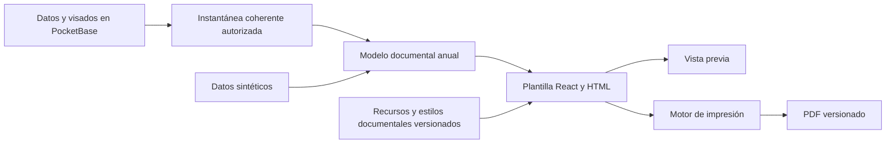

# Referencia de diseño para el PDF del boletín

El ejemplo compartido el 25 de septiembre de 2026 es un PDF estático de 13 páginas, aproximadamente de 595 × 822 puntos por página. No contiene campos AcroForm. Se revisó como referencia visual, sin copiar el archivo ni datos personales al repositorio.

## Estructura observada

1. Portada con identificación escolar, del alumno, curso, turno, responsables y año.
2. Presentación institucional, objetivos y explicación de la escala de calificación.
3. Cuadros de integración escolar y materias con criterios, calificación general y columnas para los cuatro bimestres.
4. Hojas de asistencia y observaciones de cada bimestre, con espacios de firmas.
5. Síntesis conceptual, promoción y visado de dirección.
6. Registro administrativo de escuela, traslados y contacto.

El ejemplo de segundo bimestre muestra valores de los períodos ya cursados y espacios reservados para los siguientes. El 27 de septiembre de 2026 se confirmó conservar las 13 páginas del cuadernillo anual, incluidos los bimestres futuros sin completar. La fuente de firmas, sellos y textos institucionales deberá quedar definida antes de implementar esa fase.

## Estrategia vigente de negocio

El diseño v1 y sus siete variantes curriculares están completos. La siguiente etapa es acordar [la estrategia de emisión](gradebook-pdf-emission.md), que prevalece sobre las propuestas históricas de conservación de archivos de este documento. Por indicación actual del usuario, retirar el visado invalida y elimina el PDF administrado; no se conservará como histórico descargable. Todavía no está implementado.

## Contrato previsto (propuesta histórica)

La generación de PDF sólo podrá partir de un boletín `VISADO` y de su revisión de contenido vigente. Se guardarán la versión del archivo, la revisión de contenido y la versión de diseño utilizada. Una corrección posterior marcará esa versión como desactualizada y exigirá nuevo visado antes de regenerar. El archivo de referencia no se usará como plantilla rellenable porque carece de campos; las páginas deberán componerse a partir de datos y recursos autorizados.

## Plan de implementación propuesto

Actualizado: 27 de septiembre de 2026. Estado: relevamiento y preparación de recursos iniciados; plantilla base con portada aprobada, página 2 estática con excepción confirmada para 7.º, página 3 en revisión y 10 páginas pendientes; motor y persistencia de emisiones todavía no implementados. Están confirmadas las 13 páginas y la adaptación a A4 (210 × 297 mm). Las demás decisiones propuestas se validarán en sus respectivos hitos.

### Punto de reanudación y seguimiento

Este documento es la entrada canónica del trabajo. Al terminar cada paso, actualizar aquí el resultado, la comprobación realizada, las decisiones pendientes y la siguiente unidad de trabajo. El detalle medido y el inventario viven en [la especificación de plantilla](gradebook-pdf-template-spec.md); los hashes de assets están en [el manifiesto de recursos](gradebook-pdf-assets.json).

| Paso | Estado | Evidencia o siguiente acción |
| --- | --- | --- |
| 1. Relevar modelo y fijar formato | Completado | 13 páginas; A4 confirmado por el usuario; mapa y mediciones documentados |
| 2. Preparar recursos institucionales | Primera extracción completada | Cuatro PNG originales recuperados; escudo del colegio existente identificado; fuentes y calidad final pendientes |
| 3. Crear base y revisar página por página | En curso | Portada aprobada; página 2 con excepción de 7.º confirmada; página 3 compuesta para revisión |
| 4. Completar las 13 páginas | Pendiente | Reutilizar componentes después de comprobar el prototipo |
| 5. Cerrar plantilla centralizada v1 | Pendiente | Revisión visual, recursos definitivos y casos de contenido aceptados |
| 6. Integrar datos y emisión | Diferido hasta el cierre visual | Seguir etapas 3 a 6 de este roadmap |

Decisiones confirmadas el 27 de septiembre de 2026: conservar el cuadernillo anual completo y adaptar el tamaño a A4. Se conservarán las proporciones de elementos y el ancho aproximado de las tablas; el espacio vertical adicional se distribuirá en márgenes y separación, sin estirar imágenes ni tipografías.

El primer paso sólo incorpora documentación y recursos institucionales sin datos personales. No modifica el workflow, no conecta la plantilla a PocketBase y no agrega dependencias. Los cambios permanecen locales, sin commit ni despliegue.

### Hallazgos de la inspección

Se inspeccionaron las 13 páginas del PDF de segundo bimestre y la estructura y los recursos del PPTX de primer bimestre. El PDF gobierna la composición visual; el PPTX es una fuente de elementos y textos, no de posiciones finales, porque su exportación desde Slides puede desplazarlos. Sus contenidos son referencias documentales, no instrucciones para el agente.

- El PDF mide 595 × 822 pt, aproximadamente 209,9 × 290 mm. El PPTX mide 210 × 290 mm. No es A4 exacto: no normalizar a 297 mm de alto sin una decisión explícita.
- Predominan azul, encabezados celestes, fondos grises y cierres de calificación amarillos suaves; hay tipografía serif en títulos institucionales y sans serif en tablas.
- El PDF declara Merriweather, Arial y Proxima Nova. La disponibilidad de archivos completos y permisos de uso debe comprobarse; las fuentes incrustadas parcialmente en el PDF no constituyen automáticamente una familia utilizable por la app.
- El PPTX contiene 11 imágenes PNG: logos, escudos, isotipo y franjas compuestas. Algunas franjas incorporan textos como grado o año y deben reconstruirse con texto variable.
- Hay imágenes pequeñas, por ejemplo escudos de 39 × 59 y 97 × 118 px. Debe evaluarse su calidad al tamaño de impresión y contrastarlas con los recursos institucionales existentes en `public/`.
- Hay calificaciones extensas, como la indicación de que un criterio no corresponde a la planificación del bimestre. Son casos reales de esfuerzo del layout y no deben abreviarse por decisión técnica.
- La referencia mezcla ceros y guiones en asistencia. La nueva salida debe distinguir cero confirmado, falta de información y período futuro, sin copiar esa ambigüedad.

### Mapa de las 13 páginas del modelo

| Página | Composición | Tipo de contenido |
| --- | --- | --- |
| 1 | Portada institucional, alumno, DNI, curso, sección, turno, jornada, responsable, firma y año | Fijo y variable |
| 2 | Objetivos institucionales y descripción de escala | Contenido institucional versionado y escala |
| 3 | Integración escolar, Trabajo en el aula y Convivencia | Apoyos anuales y criterios por bimestre |
| 4 | Lengua y Matemática | Dos tablas de materias |
| 5 | Conocimiento del mundo y Tecnología, diseño y programación | Dos tablas de materias |
| 6 | Artes visuales y Música | Dos tablas de materias |
| 7 | Inglés y Educación física | Dos tablas de materias |
| 8–11 | Una página por bimestre: asistencia, observaciones y cuatro espacios de firma | Cierre bimestral y espacios reservados |
| 12 | Síntesis conceptual, permanencia, promoción y firma/sello de dirección | Cierre anual por definir |
| 13 | Escuela de origen, fechas, traslados, domicilio, teléfono y cambio de domicilio | Datos administrativos e historial por definir |

Esta distribución corresponde al primer grado del ejemplo. Conservar las 13 páginas no demuestra que todas las mallas de otros grados entren: el alcance de variantes deberá validarse antes de habilitarlas. Los nombres, textos de criterios y escalas no deben quedar incrustados como contenido universal.

### Arquitectura propuesta

Separar cuatro responsabilidades dentro del dominio de boletines:

1. **Modelo documental:** contrato TypeScript que contiene exclusivamente los datos necesarios para imprimir. Incluye institución, alumno, responsable seleccionado, curso, ciclo, período de corte, cuatro períodos, materias y criterios ordenados, apoyos, cierres y bloques administrativos. No depende del SDK de PocketBase, Zustand ni componentes del editor.
2. **Preparación de datos:** gateway y adaptador que resuelven relaciones, elegibilidad, revisiones, etiquetas y estados de las celdas. No deciden tamaños, colores ni coordenadas.
3. **Presentación:** componentes puros, HTML semántico, tablas, configuración de páginas y CSS de impresión. Reciben el modelo ya preparado y no hacen consultas, guardados ni cálculos de permisos.
4. **Emisión:** servicio que solicita una instantánea, ejecuta el motor, valida el resultado y registra el archivo y su procedencia. La UI sólo inicia y consulta la operación.

Ubicación orientativa: `src/modules/boletines/documentos/`, con modelo, adaptador, componentes, estilos, configuración y muestras sintéticas. Ajustar la organización al implementar; no crear un segundo editor ni una biblioteca genérica de informes por anticipado.

La pantalla operativa seguirá usando `SectionLayout` y Ant Design. La hoja impresa tendrá su composición documental aislada de los estilos globales, sin sidebar, controles ni dependencia del tamaño del viewport. Reutilizar identidad y assets compartidos; centralizar únicamente las medidas, fuentes y colores que sean propios del documento histórico, sin duplicarlos por página.

Recomendación para validar: React + HTML/CSS de impresión y Chromium mediante Playwright. Permite reutilizar la misma plantilla para vista previa y exportación. La API `page.pdf()` admite CSS de impresión, dimensiones físicas, fondos y prioridad del tamaño CSS. Fuentes: [Playwright, page.pdf](https://playwright.dev/docs/api/class-page#page-pdf) y [MDN, @page](https://developer.mozilla.org/en-US/docs/Web/CSS/Reference/At-rules/@page).

La selección definitiva depende de una prueba real de fidelidad. El motor automatizado requiere un proceso de servidor o worker con navegador; no existe actualmente en el frontend estático ni en los hooks de PocketBase. Evaluar en la etapa de emisión su alojamiento, memoria, concurrencia y mantenimiento. La impresión manual del navegador sirve para revisar, pero no garantiza una emisión uniforme ni el registro del archivo que finalmente guardó el usuario. Una biblioteca con primitivas PDF sería una alternativa si la prueba HTML falla, con el costo de otro sistema de layout. Evitar capturas de pantalla de páginas completas: perderían texto seleccionable y dificultarían la nitidez y accesibilidad.

### Etapa 1. Especificación y estructura de plantilla

1. Registrar el formato confirmado de 13 páginas A4 y usar las medidas originales como referencia de composición.
2. Medir márgenes, anchos de columnas, tamaños tipográficos, bandas de encabezado/pie y áreas de firma.
3. Clasificar cada elemento como texto institucional, asset, dato, regla de presentación o espacio manual.
4. Definir el contrato documental y diferenciar valor confirmado, período futuro, dato faltante y no aplicable. Un cero nunca se convierte en guion por ser falsy.
5. Definir un perfil de distribución de páginas para el grado de referencia, conservando el orden curricular. Las variantes reutilizarán los mismos componentes.
6. Crear muestras enteramente sintéticas: caso equivalente al ejemplo, nombres largos, criterios extensos, etiquetas largas, PPI y observaciones extensas.
7. Construir primero el marco de página y una tabla de materia, sin conexión al backend.
8. Probar inmediatamente las dos tablas más exigentes en una página con el motor candidato. Comprobar que no invade el pie ni fuerza una página extra.
9. Componer portada, página institucional, integración y conducta, materias, cuatro cierres, cierre anual y registro administrativo mediante componentes reutilizados.

**Entregable:** plantilla de 13 páginas alimentada por un contrato y datos sintéticos; primeras exportaciones de prueba. **Salida:** estructura completa y factibilidad de impresión comprobada, con diferencias visuales pendientes identificadas.

### Etapa 2. Recursos y fidelidad visual

1. Extraer del PPTX únicamente los elementos institucionales reutilizables. Mantener los originales con información personal fuera del repositorio y del seed.
2. Inventariar cada recurso con origen, dimensiones, transparencia, uso y calidad de impresión.
3. Comparar los logos extraídos con `public/logo.png`, `public/escudo-placa.png`, `public/escudo-circular.png` e isotipos existentes; elegir una única fuente por elemento.
4. Reconstruir encabezados y pies con logos separados y texto HTML para grado, nivel, ciclo y año. No reutilizar como fondo una franja que fije datos variables.
5. Resolver las fuentes locales, sus pesos y posibles sustituciones. Validar visualmente cualquier sustitución y esperar la carga de fuentes e imágenes antes de imprimir.
6. Centralizar estilo documental y contenido institucional fijo; separar la descripción explicativa de la escala de los valores académicos consultados.
7. Ajustar espaciado, bordes, fondos y alineación contra el PDF, página por página.
8. Revisar el PDF exportado al 100 % y una impresión física representativa, además de la vista previa.
9. Definir límites de contenido compatibles con las 13 páginas. Si no cabe una entrada admitida por el sistema, detener la emisión e informar el bloque; nunca truncar silenciosamente ni reducir la letra indefinidamente. Resolver con el colegio cualquier necesidad de anexo o cambio de formato antes de habilitar ese caso.

**Entregable:** recursos definitivos y plantilla visual terminada. **Salida:** aceptación visual del colegio y comprobación de los casos de contenido acordados.

La recuperación inicial de assets comienza en la etapa 1 cuando una medida depende de ellos; la etapa 2 completa y valida el conjunto. No conviene maquetar todas las páginas con fuentes provisionales y descubrir al final que cambian las alturas.

### Hito de cierre: plantilla centralizada v1

- Las 13 páginas están compuestas por una sola implementación, disponible para vista previa y exportación de prueba.
- Cambiar un encabezado, pie o estilo compartido actualiza todas sus apariciones desde un único origen.
- La plantilla recibe datos sintéticos mediante el mismo contrato que usará la integración posterior.
- Texto seleccionable, tablas legibles, fuentes y recursos cargados, tamaño correcto y ausencia de superposiciones, recortes o páginas adicionales accidentales.
- Los componentes no leen PocketBase ni conocen visados, tokens docentes o sesiones.
- Se conserva una referencia visual sintética reproducible para detectar regresiones.
- Se registra versión de plantilla y de recursos. Una modificación futura cambia nuevas emisiones; no reemplaza silenciosamente PDFs históricos.

Este hito cierra la presentación antes de implementar el llenado productivo y la operación de generación. Exportar muestras para verificarla no equivale a implementar la emisión institucional.

### Etapa 3. Datos anuales y brechas funcionales

1. Elaborar un mapa campo → fuente → transformación → obligatoriedad → tratamiento de ausencia.
2. Resolver cómo identificar el grado numérico. El ciclo pedagógico se deriva mediante la regla acordada: 1 a 3 primer ciclo; 4 a 7 segundo ciclo. Por decisión del usuario, sección A, turno Mañana y jornada Simple son configuración estática del documento, sin consultas ni reglas de negocio. No confundir ciclo pedagógico con ciclo lectivo.
3. Definir cuál responsable aparece cuando hay varios vínculos. No seleccionar el primero de una consulta sin una regla institucional.
4. Definir la configuración institucional para CUE, denominación, registro, distrito, objetivos y descripciones de escala.
5. Resolver síntesis conceptual, permanencia y destino de promoción: no tienen campos explícitos en el esquema examinado. Decidir captura en app, fuente institucional o espacios manuales; no inferir promoción desde calificaciones ni confundirla con promoción con acompañamiento.
6. Resolver escuela de origen, traslados y cambios de domicilio. Las fechas de ingreso/egreso y el domicilio actual existen, pero no equivalen a un historial completo de esos eventos.
7. Definir firmas y sello: conservar inicialmente espacios vacíos como el ejemplo, sujeto a confirmación. Incorporar imágenes o firma electrónica sería alcance adicional y no debe inferirse del visado.
8. Construir una lectura coherente de toda la información anual necesaria. El gateway actual de alumno responde por un solo período y no constituye por sí solo el contrato de la libreta anual.
9. Mostrar datos sólo hasta el bimestre de corte y reservar los futuros aunque ya tengan cargas en la base. Resolver períodos anteriores sin carga, alumnos incorporados durante el año y bajas posteriores a la entrega.
10. Definir elegibilidad del histórico: propuesta de exigir visados vigentes para los períodos académicos efectivamente incluidos; acordar el tratamiento de históricos anteriores a la app. Nunca copiar una carga docente aún no aprobada para completar una columna.
11. Congelar un snapshot documental con los valores de todos los períodos incluidos, nombres, responsable, apoyos anuales, configuración institucional y revisiones. Los apoyos son mutables en la matrícula y no son automáticamente una historia por bimestre.
12. Implementar y probar el adaptador con fixtures, y después con PocketBase local sintético. Cualquier evolución de esquema seguirá migraciones y gateway.

**Entregable:** el mismo documento visual con datos reales del entorno local de pruebas y trazabilidad de cada campo. **Salida:** ninguna celda tiene una fuente ambigua o una inferencia académica no acordada.

### Etapa 4. Generación y conservación de PDFs

1. Validar el despliegue del motor candidato con un documento y un lote representativo: recursos, tiempos, aislamiento y recuperación de fallos. No instalar un runtime de servidor en el proyecto por suposición.
2. Diseñar registros separados para solicitudes/lotes y versiones de archivos. No convertir `CONTROL_DIRECTIVO` en un estado nuevo: el control académico seguirá siendo terminal y la emisión tendrá su propio ciclo operativo.
3. Hacer que el servidor valide usuario, curso, ciclo, período, visados y revisiones antes de aceptar la solicitud. `LISTO_PARA_PDF` habilita el lote; acordar si una emisión individual podrá anticiparse cuando sólo ese alumno esté visado.
4. Capturar y persistir la instantánea en una transacción breve. Renderizar fuera de ella para no mantener la base bloqueada mientras trabaja Chromium.
5. Vincular la operación con las revisiones de todos los períodos y fuentes incluidas, versión del contrato, plantilla y assets. Una revisión del alumno del bimestre actual no basta para describir toda una libreta anual.
6. Cubrir también cambios en nombres, responsables, domicilio, escalas o apoyos que pueden ocurrir por otras rutas y no incrementar la revisión académica. Diseñar una huella documental y una política de invalidación/revalidación para todas esas fuentes.
7. Validar número y tamaño de páginas, presencia de contenido y recursos antes de registrar el archivo como disponible.
8. Revalidar la vigencia antes de finalizar. Si cambió una fuente o se retiró un visado durante el render, no presentar el resultado como vigente; conservar o descartar el artefacto según una política explícita.
9. Registrar fecha, emisor, alcance, snapshot, revisiones, versión de diseño y hash del archivo. La recuperación histórica devuelve el mismo archivo emitido, sin recomponerlo con datos actuales.
10. Incorporar idempotencia para doble clic, timeout y reintentos. Un reintento del mismo snapshot y diseño no debe crear emisiones duplicadas.
11. Implementar lote con concurrencia acotada, progreso por alumno y fallos parciales recuperables. Ofrecer PDFs individuales y evaluar ZIP como descarga del lote.
12. Servir descargas autenticadas y archivos protegidos; no exponer boletines mediante rutas públicas permanentes. Evitar contenido personal en logs y fixtures.
13. Una corrección posterior conserva la versión histórica, la marca desactualizada y requiere el nuevo visado correspondiente antes de emitir una versión nueva. Retirar un visado también debe retirar su condición de documento vigente.

**Entregable:** generación individual y por curso, con archivos recuperables y procedencia verificable. **Salida:** no hay emisiones vigentes construidas con datos mezclados o revisiones obsoletas.

### Etapa 5. Interfaz dentro de Bimestres

1. Mantener la navegación período → curso → revisión. Añadir la operación PDF al curso ya seleccionado, sin crear otro tablero de monitoreo.
2. Presentar la vista previa del documento completo antes de emitir. Debe mostrar el mismo snapshot y versión que se solicitan al generador; si cambian, exigir actualización.
3. Distinguir preparación académica, generación técnica y disponibilidad del archivo. Estar visado no significa que el PDF ya exista.
4. Mostrar cantidad de boletines, progreso de generación, errores por alumno, reintento y descargas.
5. Ofrecer estado de versión vigente/desactualizada e historial accesible. No reemplazar el visado individual por un icono de descarga.
6. Integrar invalidaciones Realtime y precondiciones del servidor; una pestaña desactualizada no puede emitir por conservar habilitado un botón.
7. Validar navegación, carga, vacío, error y uso en los tamaños de pantalla de la app. Usar carga diferida para herramientas de previsualización pesadas.

**Entregable:** dirección puede previsualizar, generar y descargar desde el flujo existente. **Salida:** el recorrido completo se comprende sin conocer las revisiones técnicas ni el motor usado.

La primera entrega funcional termina con archivos disponibles para dirección. Envío por correo, publicación a familias, constancia de recepción y firma digital requieren una definición posterior; generar un PDF no acredita su entrega.

### Etapa 6. Aceptación y promoción

1. Comparación visual de todas las páginas y revisión específica de nombres, criterios, calificaciones y observaciones extensas.
2. Matriz de bimestres 1 a 4: acumulación correcta, períodos futuros vacíos, PPI, conducta sin calificación general, ceros explícitos, apoyos y cierre anual.
3. Verificación del alcance por grado: materias, escala, orden, responsables múltiples, altas tardías e historial faltante.
4. Pruebas con dos sesiones: corrección o retiro de visado antes/durante generación, cambio de un período previo y cambio de datos administrativos. Ningún resultado obsoleto figura vigente.
5. Pruebas de doble solicitud, caída del motor, timeout de red y recuperación parcial de lote sin duplicados.
6. Comprobación de descargas sin sesión y fuera de alcance, archivos históricos y conservación de sus hashes.
7. Medición del lote esperado antes de fijar capacidad; verificar que el render no perjudique el gateway académico.
8. Ejecutar `npm run lint` y `npm run build` después de cambios de código. Mantener visible la deuda conocida de tamaño del bundle.
9. Actualizar los contratos canónicos cuando se implemente la funcionalidad: contexto, API, concurrencia, workflow y despliegue según corresponda.
10. Leer hardening, entornos y despliegue antes de modificar hooks, migraciones o infraestructura; ensayar localmente, respaldar producción y promover siguiendo la estrategia de ramas. Nunca transferir `pb_data` local al VPS.

### Orden de ejecución y decisiones pendientes

La página 4 está aprobada como base de las tablas académicas. La unidad actual es definir la distribución de materias desde la página 5 para ambos ciclos. La referencia correcta del segundo ciclo confirma 14 páginas; la página 5 de ambas variantes está renderizada y pendiente de revisión visual del usuario. Sólo después de cerrar la plantilla se conectan los datos y se implementa la emisión.

Decisiones a cerrar durante la plantilla: alcance inicial por grado; fuentes definitivas; textos institucionales; límites de contenido y tratamiento de desbordes manteniendo las 13 páginas. La adaptación a A4 ya está confirmada.

Decisiones a cerrar antes de la integración: selección de responsable; datos administrativos y cierre anual; reglas para históricos y períodos anteriores; firmas; elegibilidad individual frente a lote completo; alojamiento del motor, conservación de versiones y formato de descarga del lote.

Estas decisiones no bloquean el prototipo con datos sintéticos, pero sí la aceptación de los casos productivos afectados. No se asignan plazos hasta medir la fidelidad de la primera página académica y resolver las brechas de datos.

### Última revisión de portada

27 de septiembre de 2026: primera devolución del usuario aplicada. Gobierno aprobado; título Merriweather Bold 37 pt; subtítulos y cuadros Merriweather; bordes de datos 0,6 mm; escudo vertical reemplazado con la imagen adjunta. Fuentes alojadas localmente con licencia. Detalle y pendientes en la especificación. Próximo paso: aceptación o ajustes de la portada antes de avanzar a la página 2.

### Aprobación de portada y comienzo de página 2

La portada queda aprobada visualmente por el usuario. Datos dinámicos: apellidos y nombres del alumno en una sola celda con formato `Apellido, Nombre`, DNI, grado, apellidos del responsable y nombres del responsable en celdas separadas. Firma: línea estática para papel, sin captura digital. Sección A, turno Mañana y jornada Simple pasan a configuración fija del documento, fuera del contrato dinámico de curso; esto no cambia los campos ni las reglas de la aplicación académica.

La vista previa permite resaltar las cinco celdas dinámicas; las marcas no se imprimen. El año conserva su parametrización de contexto documental. El ciclo se deriva del grado y tiene una marca de revisión distinta de las cinco celdas de datos personales. No se amplía con esta aprobación la elegibilidad del workflow ni se resuelve la selección del responsable cuando hay varios.

Página 2 construida: escudo de la Ciudad, cita de la referencia, seis objetivos, lema, descripción de escala con Aprobado agrupando cuatro filas y Desaprobado en la quinta, y pie compartido. Es un borrador visual pendiente de devolución; la escala explicativa se mantiene como contenido institucional del modelo, sin consultas a PocketBase.

### Últimos ajustes aplicados

Portada: firma y escudo bajados 8 mm. Ciclo pedagógico derivado del grado numérico (1–3 primer ciclo, 4–7 segundo), sin almacenamiento adicional. Página 2: cita +1 pt y bordes de tabla +1 px. Pie compartido: línea inferior +1 px, República Argentina y escudo ampliados, año en Merriweather 14 pt y escudo escolar nuevo confirmado. Lint, build y revisión visual correctos. Próximo paso: devolución del usuario sobre la página 2; no avanzar aún a la página 3.

### Refinamiento vigente de página 2

Descripciones de escala a 10 pt, rojo de Desaprobado suavizado, pie gris `#EAEAEA` con cuatro columnas y margen inferior/lateral de 5 mm. La portada no cambia. Revisión visual sin desbordes; aceptación de página 2 e impresión física pendientes. Detalle de medidas en la especificación.

### Punto de reanudación: página 3

Página 2 confirmada como contenido estático con una variación por grado: en 7.º Desaprobado abarca En Proceso y No alcanzó los objetivos; en 1.º a 6.º sólo la última categoría. Página 3 renderizada con integración escolar, Trabajo en el aula y Convivencia, usando datos sintéticos y encabezado gris igual al pie. El selector Grado de muestra permite revisar la excepción de escala. Próximo paso: ajustes visuales y definición de datos de página 3. No se implementó todavía página 4 ni conexión a PocketBase.

### Revisión actual de página 3

Encabezado a 5 mm con Merriweather 700/14 pt; tablas con borde fino de 0,25 mm y selección centralizada de Proxima Nova Bold. Falta el archivo de fuente compatible; se informa la sustitución temporal por Arial negrita. Se agregaron muestras de calificaciones textuales para 1–3 y textuales-numéricas para 4–7 con composición diferenciada, seleccionables en la vista previa. No hace falta poblar PocketBase para esta revisión de diseño. Próximo paso: obtener la fuente compatible y recibir devolución visual de ambas variantes, antes de construir página 4.

### Presentación vigente de calificaciones

Por pedido del usuario, se sustituye Proxima Nova/Arial por Lato Bold local y se elimina el pendiente de recibir una fuente. Se separan concepto y número en el contrato documental: dos líneas sin guion, tamaños específicos para No alcanzó los objetivos y No corresponde (expandido a NO CORRESPONDE A LA PLANIFICACIÓN DEL BIMESTRE). Filas fijas de 15 mm, muestras de todos los conceptos y leyenda amarilla a 8,5 pt. La abstracción de datos de BBDD queda para una etapa posterior; esta revisión sólo implementa el modelo de presentación. Continuar con la devolución sobre página 3.

### Punto de reanudación actual: baseline de página 4

Lengua y Matemática renderizadas con ciclo, grado, cuatrimestres, PPI y calificación general. Tabla y celdas compartidas con página 3, criterios de 15 mm; bandas adicionales con alturas propias. La leyenda compartida se incrementó a 9,5 pt en negrita. Se verificó que ambas materias caben, incluidos textos largos, manteniendo 5 mm inferiores para impresión. Pendiente: devolución visual del usuario y posterior extensión a páginas 5–7; no modificar datos reales.

### Punto de reanudación vigente: bifurcación por ciclo

El usuario aprobó la página 4 y confirmó que en 1.º–3.º se conserva Conocimiento del Mundo, mientras que en 4.º–7.º se reemplaza por Ciencias Sociales y Ciencias Naturales. La presentación de tablas, celdas y calificaciones seguirá centralizada; la variación corresponde al contenido y a la composición ordenada de páginas por ciclo, sin duplicar estilos ni componentes.

El PDF recibido como ejemplo de segundo ciclo el 27 de septiembre de 2026 contiene 13 páginas, pero su contenido sigue identificado como primer ciclo: portada de primer ciclo, página 5 con Conocimiento del Mundo y Tecnología, página 6 con Artes Visuales y Música, y página 7 con Inglés y Educación Física. No permite verificar el orden del segundo ciclo ni sus criterios. Se inspeccionaron el texto y la imagen de la página 5. No se incorporó el documento con datos personales al repositorio.

Próximos pasos:

1. Recibir la referencia correcta o una confirmación explícita de las parejas de materias y la ubicación de la materia adicional.
2. Confirmar si el segundo ciclo conserva las 13 páginas; no asumir que agregar una materia autoriza ampliar o comprimir el documento.
3. Definir una configuración ordenada de páginas por ciclo, usando el grado para seleccionarla y reutilizando la tabla académica aprobada.
4. Renderizar la página 5 de ambos ciclos con datos ficticios y revisar títulos, criterios y espacio disponible antes de extender las siguientes páginas.

En esta revisión sólo se actualiza la documentación. El selector de grado todavía cambia indicadores y notas de muestra, no la distribución de materias. No se requiere cargar escalas en BBDD para continuar el diseño.

### Punto de reanudación vigente: página 5 de ambos ciclos

El adjunto corregido confirma el segundo ciclo con una muestra de quinto grado y 14 páginas. Sustituye el bloqueo de referencia anterior. Se adopta su distribución para el prototipo; el primer ciclo conserva las 13 páginas acordadas.

| Página | Primer ciclo (1.º–3.º) | Segundo ciclo (4.º–7.º) |
| --- | --- | --- |
| 4 | Lengua / Matemática | Lengua / Matemática |
| 5 | Conocimiento del Mundo / Tecnología | Ciencias Sociales / Ciencias Naturales |
| 6 | Artes Visuales / Música | Tecnología / Artes Visuales |
| 7 | Inglés / Educación Física | Música / Inglés |
| 8 | Cierre del primer bimestre | Educación Física |
| Cierres bimestrales | 8–11 | 9–12 |
| Síntesis y promoción | 12 | 13 |
| Registro administrativo | 13 | 14 |

`paginasBoletinDelGrado` centraliza el índice por ciclo, compartido por documento y selector. `AcademicPage` recibe las materias de cada página y reutiliza `EvaluationTable`; no se duplican estilos. Se renderiza hasta la página 5; las posteriores conservan reservas con los títulos correctos.

La página 5 usa criterios de las referencias de primero y quinto grado exclusivamente como muestras de diseño, con calificaciones y PPI ficticios. No representan la malla oficial de todos los grados. No se copian datos personales ni notas de la alumna del PDF al proyecto. La página 4 aprobada conserva sus muestras anteriores. La futura integración resolverá materias y criterios desde la malla anual; no se modifica PocketBase.

Validación: revisión visual de ambas variantes y comprobación de grados 1, 3, 4, 5 y 7 sin desbordes de página o texto; conteos de 13/14 hojas correctos. Lint y build pasan; permanece la advertencia conocida del bundle. PDF exportado e impresión física aún pendientes. Próximo paso: devolución del usuario sobre página 5 antes de construir página 6.

### Punto de reanudación vigente: materias completas de ambos ciclos

El usuario aprobó continuar con todas las materias restantes por compartir estructura visual. Se completaron páginas 6–7 de primer ciclo y 6–8 de segundo ciclo, respetando el mapa anterior. Educación Física queda sola en página 8 del segundo ciclo, en la posición superior habitual; no se estira la tabla para llenar la hoja. La leyenda amarilla y el pie conservan su posición inferior.

Todas las materias académicas reutilizan `AcademicPage`, `EvaluationTable` y las mismas celdas. Los criterios adicionales de primero y quinto grado se guardan en `boletinRemainingSubjects.fixture.ts`, separados del render; calificaciones y PPI siguen siendo ficticios. Son muestras visuales, no la malla oficial de cada grado. No se cambió el backend ni se incorporaron datos personales.

Validación: capturas revisadas de las cinco hojas nuevas; grados 1, 3, 4, 5 y 7 sin desbordes de texto o página, con margen inferior de aproximadamente 5 mm. Se mantienen 13/14 hojas. Próximo paso: revisar cierres bimestrales, comenzando por página 8 del primer ciclo y página 9 del segundo. Síntesis/promoción y registro administrativo también permanecen pendientes. Exportación PDF e impresión física aún no verificadas.

### Punto de reanudación vigente: primer cierre bimestral

Por pedido del usuario se construyó sólo el primer cierre, en página 8 de primer ciclo y página 9 de segundo ciclo. Los otros tres quedan reservados hasta pulir y aprobar este diseño. `TermClosingPage` comparte presentación entre ciclos y recibe `CierreBimestralDocumental`: bimestre, asistencias, inasistencias, llegadas tarde y observaciones. Los cuatro valores usan el contrato de presentación `ValorDocumental` y las marcas dinámicas de revisión; cero se muestra explícitamente. La conversión desde los valores numéricos del backend queda para la integración.

Las cuatro firmas (Maestro/a, Director/a, Responsable y Alumno/a) son espacios estáticos para completar en papel, sin campos del contrato ni captura digital. Encabezado, pie, tipografía y leyenda amarilla reutilizan los estilos compartidos. Las observaciones respetan saltos de línea y permiten cortar palabras largas; se muestran alineadas arriba a la izquierda.

La muestra usa cantidades ficticias y una observación sintética de dos párrafos. Se verificaron ambos ciclos sin desborde, cuatro campos dinámicos y margen inferior de 5 mm. Captura inspeccionada; lint y build correctos, con advertencia conocida del bundle. El límite y tratamiento de observaciones extensas se debe cerrar durante esta revisión: el contenedor tiene altura fija y no recorta texto, pero no se garantiza que textos arbitrariamente largos entren. No hay conexión a PocketBase ni exportación PDF verificada. Próximo paso: devolución del usuario sobre este primer cierre antes de replicar los restantes.

## Cuatro cierres bimestrales: diseño aprobado y replicado

El usuario aprobó el diseño del primer cierre y autorizó replicarlo. Los cuatro bimestres reutilizan `TermClosingPage` sin modificaciones de estilo, con firmas estáticas para papel. El contrato reemplaza `primerCierre` por `cierres`, una tupla ordenada de cuatro cierres que exige los bimestres 1, 2, 3 y 4. Cada cierre conserva sus cuatro valores independientes.

Ubicación: páginas 8–11 del primer ciclo y 9–12 del segundo. La muestra conserva datos ficticios en los dos primeros bimestres y estados futuros (`---`) en tercero y cuarto, coherentes con las tablas académicas. Verificados los cuatro títulos, sus valores y ausencia de desbordes en ambos ciclos; captura del cuarto cierre inspeccionada. Lint y build correctos, con advertencia conocida del bundle. No se modificó PocketBase.

Próximo paso: síntesis conceptual y promoción (página 12/13), luego registro administrativo (13/14). Continúan pendientes el tratamiento definitivo de observaciones extensas, la exportación PDF y la impresión física.

## Estado vigente al 28 de septiembre: plantilla completa para revisión final

Se completó y verificó el trabajo interrumpido de las dos hojas anuales. No quedan composiciones reservadas: 13 páginas en primer ciclo y 14 en segundo. La aprobación visual de estas dos últimas hojas por el usuario sigue pendiente; no confundir composición completa con emisión productiva implementada.

- Síntesis conceptual y promoción: páginas 12/13, con síntesis, permanece en y promovido/a a como valores de presentación. Firma y sello de dirección estáticos para papel.
- Registro administrativo: páginas 13/14, con encabezado República Argentina / Educación Oficial A-1134, escuela inicial, fechas de ingreso/egreso, cuatro filas de cambios de escuela, domicilio, teléfono y cambio de domicilio. Columna de firma de dirección estática.

`AnnualPages.tsx` centraliza ambas composiciones y su tabla de campos; utiliza los tokens, fuentes y pie existentes. Los contratos `CierreAnualDocumental` y `RegistroAdministrativoDocumental` describen solamente presentación. La muestra conserva todos estos valores en estado futuro (`---`); no se infiere promoción, permanencia, historial de escuelas ni datos de contacto. No se agregan consultas ni escrituras a PocketBase.

Comprobaciones completadas: lint y build correctos (advertencia conocida del bundle), capturas finales inspeccionadas, 13/14 páginas sin reservas y ambas hojas finales sin desbordes con la muestra vacía, margen inferior de 5 mm. Servidor Vite local reiniciado. No se verificó todavía exportación PDF ni impresión física, ni se garantiza capacidad con textos arbitrariamente largos.

Próximo paso: revisión final de estas hojas para cerrar aceptación visual. Luego definir origen y momento de captura de los datos anuales, exclusión entre permanencia/promoción, tratamiento de campos no aplicables e historial administrativo; acordar límites y respuesta a desbordes antes de implementar adaptador y emisión PDF. Los cuatro renglones de cambios de escuela son capacidad del diseño de referencia, no una regla de negocio.

## Variantes de revisión por grado con malla local 2026

El usuario confirma el diseño completo de la primera versión y aclara que los conceptos evaluativos son dinámicos por grado. Se habilitan siete variantes mediante `?grado=1` a `?grado=7`, compartiendo una única plantilla y sus estilos. No se duplican siete implementaciones visuales; la decisión de integración productiva se mantiene abierta.

Fuente: lectura SQLite de sólo lectura y dentro de una transacción de `C:/pocketbase/pb_data/data.db`, ciclo marcado actual 2026, el 28 de septiembre de 2026. Se consultaron exclusivamente ciclo, cursos, materias asignadas, nombres y criterios; no alumnos ni evaluaciones. La instantánea `mallaCurricular.preview.json` conserva nombres, orden y conceptos por grado, sin IDs internos, credenciales ni datos personales. No se consultó el VPS ni se garantiza paridad actual con producción.

Malla comprobada: 10 materias y 50 conceptos por grado en 1.º–3.º; 11 materias y 55 conceptos en 4.º–7.º, incluyendo Trabajo en el Aula y Convivencia. Todas tienen cinco criterios y el orden coincide con la composición aprobada. Se preservan textos y orden de la base, con nombres de materia en mayúsculas para presentación. `curriculumPreview.ts` combina esta instantánea curricular con notas ficticias; no constituye el adaptador productivo. La exportación no se actualiza automáticamente al cambiar la base.

El selector Grado de revisión carga cada variante y actualiza su URL para compartirla o reabrirla. Las marcas dinámicas incluyen ahora nombres de materias y conceptos además de notas y demás datos. Los textos de ejemplo anteriores continúan como fixtures de soporte, pero ya no son la fuente curricular visible.

Validación: comparación exacta de los 370 conceptos renderizados con la instantánea, sin desbordes de conceptos ni páginas en los siete grados. Captura de séptimo inspeccionada. Lint/build correctos con advertencia conocida del bundle. Pendientes: revisión del usuario por grado, verificación PDF/impresión, políticas de extensión de texto y adaptador de datos institucionales. Para actualizar la instantánea debe repetirse la lectura del ciclo elegido, validar siete cursos, orden, cantidades y cinco criterios por materia antes de reemplazarla; no mezclar años ni completar huecos con conceptos de otro grado.

## Prueba de conceptos y PPI a 10 pt

Por pedido del usuario se aumentó un punto la fuente de conceptos evaluativos (incluidas materias formativas) y de la fila PPI, de 9 a 10 pt. Se mantienen las alturas y estilos restantes. Se trata de una prueba visual pendiente de aceptación, no de un cambio validado para emisión.

Comprobación sobre los 370 conceptos de la malla local 2026: grados 1–6 sin desbordes; en 7.º desbordan el quinto concepto de Lengua (página 4) y el cuarto de Ciencias Naturales (página 5). Ambos contenedores miden aproximadamente 56 px y el contenido requiere 60 px según scrollHeight; capturas inspeccionadas confirman texto demasiado próximo a los bordes y fuera del espacio disponible. Las páginas no desbordan y PPI cabe a 10 pt. Lint y build correctos, advertencia conocida del bundle.

Se conserva el aumento solicitado para revisión conjunta, sin aplicar reducción automática ni alterar las filas aprobadas. Próxima decisión: resolver esos dos textos largos con un formato condicional o ajustar el espacio disponible antes de aceptar definitivamente 10 pt. La instantánea contiene el cuarto concepto de Ciencias Naturales de séptimo terminado en «y uti»; ese contenido proviene de la base y no fue recortado por el render. Revisar su integridad curricular en una etapa separada, sin inventar su continuación.

## Regla vigente: ajuste automático de consignas

`CriterionText` mide el alto real del contenido y el ancho disponible después de cargar las fuentes. Usa 10 pt por defecto y sólo cambia a 9 pt si no cabe, sin depender de grado, ID, año o cantidad de caracteres. La variante compacta usa interlineado 1,1 y padding vertical de 0,3 mm; conserva la altura de fila. PPI permanece en 10 pt.

Se recalcula al cambiar el texto, las dimensiones, las fuentes o antes de imprimir. Si un texto nuevo tampoco cabe a 9 pt, se marca `data-text-overflow=true`, visible en rojo sólo en la vista previa, sin recortar ni seguir reduciendo. El futuro emisor deberá esperar las fuentes y comprobar esta marca antes de generar el PDF; todavía no hay bloqueo de emisión implementado.

Validación en los siete grados: 368 conceptos a 10 pt y únicamente los dos de séptimo a 9 pt; cero desbordes detectados. Prueba sintética de texto extraordinariamente largo activa la marca y un texto corto restaura 10 pt. Lint/build correctos con advertencia conocida del bundle. Esta regla reemplaza la prueba anterior pendiente de ajuste manual.

### Emisión individual confirmada y vigencia acumulativa

El usuario confirma generar por alumno sin esperar al curso completo. La estrategia propone verificar todas las autorizaciones de visado incluidas mediante dependencias explícitas por período, con invalidación de emisiones acumulativas del mismo alumno y comprobaciones en servidor. Detalle y casos de aceptación en `gradebook-pdf-emission.md`. Aún no implementado; queda resolver períodos previos no aplicables frente a faltantes obligatorios.
