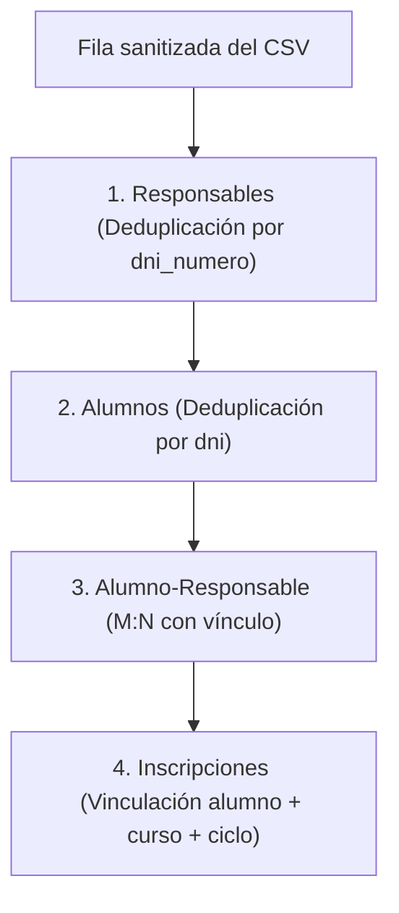

# Guía canónica de ingesta de estudiantes y cursada

Actualizado: 29 de septiembre de 2026.

## 1. Propósito y alcance

Este documento establece el contrato, las reglas de sanitización de datos y el procedimiento operativo para la ingesta masiva de alumnos, responsables, vínculos e inscripciones escolares en PocketBase mediante la hoja maestra consolidada del colegio (Google Sheets).

Aplica para la carga inicial de septiembre de 2026 (ciclo lectivo ya iniciado con estudiantes regulares y egresos previos) y para futuras incorporaciones masivas de cursadas.

---

## 2. Reglas de privacidad y seguridad

- **PII y confidencialidad:** Los archivos CSV exportados con datos de menores y familias reales **nunca deben commitearse en Git**, incluirse en PRs ni almacenarse en carpetas bajo control de versiones.
- **Entorno de pruebas:** Probar siempre la ingesta primero en el entorno local (`127.0.0.1:8090`). Solo promover y ejecutar en producción (`https://alumnos-api.duckdns.org`) una vez completada la verificación visual y relacional.
- **Semilla de desarrollo (`deploy/pocketbase-dev-seed`):** Permanece 100% sintética según el contrato de `AGENTS.md`. No incorporar registros de estudiantes reales a los seeds.

---

## 3. Especificación de columnas de la Hoja Maestra (Google Sheets)

El CSV exportado debe ser codificado en UTF-8 y contener exactamente los siguientes encabezados (separados por coma):

```csv
alumno_dni,alumno_apellidos,alumno_nombres,alumno_legajo,alumno_fecha_nacimiento,alumno_sexo,alumno_nacionalidad,alumno_domicilio,alumno_localidad,alumno_usuario_acadeu,alumno_clave_acadeu,ciclo_ano,curso_nombre,numero_orden,numero_inscripcion,fecha_ingreso,fecha_inscripcion,estado_inscripcion,fecha_egreso,promociono_con_acompanamiento,posee_apoyos,cuales_apoyos,responsable_dni_tipo,responsable_dni_numero,responsable_apellidos,responsable_nombres,responsable_vinculo,responsable_telefono,responsable_email,responsable_nacionalidad,responsable_profesion
```

### Reglas de sanitización en el origen (Google Sheets)

Para mantener el script determinístico y libre de heurísticas ambiguas, la hoja de cálculo debe cumplir estas reglas antes de exportar:

1. **Encabezado `responsable_dni_numero`:**
   - Escribir `responsable_dni_numero` con una sola letra `n` (no `nnumero`).
2. **Formato de Fechas (`YYYY-MM-DD`):**
   - Columnas: `alumno_fecha_nacimiento`, `fecha_ingreso`, `fecha_inscripcion`, `fecha_egreso`.
   - Formato requerido: ISO estándar `YYYY-MM-DD` (ej. `2019-09-02`, `2026-02-25`, `2026-04-13`).
   - Configuración en Sheets: Seleccionar las columnas $\to$ *Formato* $\to$ *Número* $\to$ *Fecha personalizada* $\to$ `aaaa-mm-dd`.
   - Celdas sin fecha (por ej. `fecha_egreso` de un alumno regular) deben dejarse completamente en blanco (vacías).
3. **Columna `alumno_sexo`:**
   - Valores requeridos: `Femenino` o `Masculino` (evitar abreviaturas `M`, `V` o `F`).
   - Opciones complementarias soportadas por la UI: `No binario`, `Otro`.
4. **Columna `curso_nombre`:**
   - Debe coincidir de forma exacta con el registro en la colección `cursos` de PocketBase.
   - En primaria: `1°`, `2°`, `3°`, `4°`, `5°`, `6°`, `7°` (sin letra de división añadida si la institución opera una única sección por año).
5. **Columna `ciclo_ano`:**
   - Año numérico del ciclo lectivo (ej. `2026`). Debe existir previamente en `ciclos_lectivos`.
6. **Columna `estado_inscripcion`:**
   - Opciones válidas: `Regular`, `Baja`, `Libre`.
   - Todo registro con estado `Baja` debe incluir obligatoriamente su `fecha_egreso` (`YYYY-MM-DD`).
7. **Columnas de inclusión y apoyos:**
   - `promociono_con_acompanamiento`: `SI`, `NO`, `-`, o celda vacía.
   - `posee_apoyos`: `SI`, `NO`, `-`, o celda vacía.
   - `cuales_apoyos`: Texto descriptivo o vacío.
8. **Columna `responsable_vinculo`:**
   - Valor institucional habitual: `Padre` (por defecto), `Madre`, `Tutor`, etc.
9. **Campos pendientes de suministro (`alumno_legajo`, `responsable_telefono`, `responsable_email`):**
   - Dejar las celdas en blanco. No ingresar guiones, `N/A` ni textos ficticios. PocketBase los admite como cadenas vacías sin violar validaciones.

---

## 4. Integridad referencial y orden de inserción

El proceso de ingesta ejecuta 4 fases encadenadas respetando las claves foráneas de PocketBase:



1. **Responsable (`responsables`):**
   - Busca existencia por `dni_numero = row.responsable_dni_numero`.
   - Si existe, reutiliza su `id` para evitar duplicar padres o tutores con más de un hijo en el establecimiento.
   - Si no existe, crea el registro.
2. **Alumno (`alumnos`):**
   - Busca existencia por `dni = row.alumno_dni`.
   - Si no existe, crea la ficha con datos personales, credenciales Acadeu y fecha de nacimiento.
3. **Vínculo Alumno-Responsable (`alumno_responable`):**
   - Verifica si ya existe el par `alumno_id` + `responsable_id`.
   - Si no existe, inserta el vínculo con su atributo `vinculo`.
4. **Inscripción (`inscripciones`):**
   - Resuelve `curso_id` por `curso_nombre` y `ciclo_id` por `ciclo_ano`.
   - Verifica si existe inscripción para esa combinación en el ciclo lectivo.
   - Si no existe, inserta con `numero_orden`, `numero_inscripcion`, fechas y estado (`Regular` / `Baja`).

---

## 5. Herramienta de automatización: `scripts/ingest-students.mjs`

El script implementa el modo seguro con dos comandos principales:

### Opciones CLI:
- `--csv <ruta>`: Ruta al archivo CSV sanitizado.
- `--dry-run`: Modo predeterminado. Valida tipos, fechas, formatos, existencia de cursos/ciclos y reporta anomalías sin escribir en la base de datos.
- `--execute`: Ejecuta las inserciones reales mediante la API Admin de PocketBase.
- `--url <url>`: URL base de PocketBase (por defecto `http://127.0.0.1:8090` o variable `PB_URL`).
- `--email <email>`: Correo de administrador (o variable `PB_ADMIN_EMAIL`).
- `--password <pass>`: Contraseña de administrador (o variable `PB_ADMIN_PASSWORD`).

### Ejemplo de uso local (desarrollo):
```bash
# Validación en seco (no altera la BBDD):
node scripts/ingest-students.mjs --csv C:\ruta\alumnos-2026.csv --dry-run

# Ingesta definitiva en desarrollo local:
node scripts/ingest-students.mjs --csv C:\ruta\alumnos-2026.csv --execute
```

### Ejemplo de uso en producción (VPS):
```bash
node scripts/ingest-students.mjs \
  --url https://alumnos-api.duckdns.org \
  --email admin@creceryser.local \
  --password "SECRET_PASSWORD" \
  --csv /ruta/alumnos-2026.csv \
  --execute
```

---

## 6. Procedimiento de verificación posterior a la ingesta

Tras finalizar la ejecución con `--execute`:

1. Ingresar al frontend institucional (`/app/alumnos`).
2. Filtrar por cada uno de los cursos (`1°`, `2°`, etc.).
3. Verificar:
   - Orden correlativo por `numero_orden`.
   - Correcta visualización de chips de estado (`Regular` vs `Baja`).
   - Apertura del modal de detalle: verificar vínculo familiar, domicilio, localidad y credenciales Acadeu.
